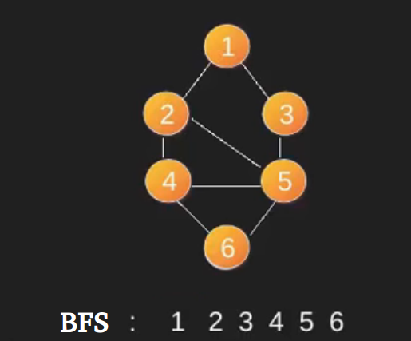

# Competitive Programming

### What is an Algorithm ?

An algorithm is a set of well-defined instructions in sequence to solve a problem.
Informally, an algorithm is nothing but a mention of steps to solve a problem.
They are essentially a solution.

### Asymptotic Analysis

The efficiency of an algorithm depends on the amount of time, storage and other resources required to execute the algorithm.
The efficiency is measured with the help of asymptotic notations.

An algorithm may not have the same performance for different types of inputs.
With the increase in the input size, the performance will change.

The study of change in performance of the algorithm with the change in the order of the input size is defined as asymptotic analysis.

Asymptotic notations are the mathematical notations used to describe the running time of an algorithm when the input tends towards a particular value or a limiting value.

For example: In bubble sort, when the input array is already sorted, the time taken by the algorithm is linear i.e. the best case.

But, when the input array is in reverse condition, the algorithm takes the maximum time (quadratic) to sort the elements i.e. the worst case.

When the input array is neither sorted nor in reverse order, then it takes average time. These durations are denoted using asymptotic notations.

There are mainly three asymptotic notations: Theta notation, Omega notation and Big-O notation.

#### Theta Notation (Θ-notation)

> It is used for analyzing the average case complexity of an algorithm.

#### Big-O Notation (O-notation)

> It gives the worst case complexity of an algorithm.

#### Omega Notation (Ω-notation)

> It provides best case complexity of an algorithm.

**NOTE**

A rule of thumb is that our computers do roughly 10^8 operations per second (this value gets outdated really fast). So to check whether our solution is correct, the first step is to ensure that the time complexity is good enough to meet the timing requirements of the problem (usually the time limit is 1 second). To do this, first calculate the worst case time using big O notation. Substitute the constraints and check if the value <= 10^8.
For eg. our algorithm has a complexity of O(n^2) and n <= 10^6. Substituting n yields roughly 10^12 operations. Do note that this is not the exact number of operations, rather a rough estimate. Since 10^12 is much much bigger than 10^8, we can safely conclude that our algorithm won't run in under 1 second.

**Further Resources**

- [Intro To Algorithm Analysis](https://drive.google.com/file/d/0B-W-TWxgtybGd3dFUzg1OHNsM2M/view)
- [MCQS on TimeComplexity Analysis](https://discuss.codechef.com/t/multiple-choice-questions-related-to-testing-knowledge-about-time-and-space-complexity-of-a-program/17976)
- [Codechef DSA week 1](https://www.codechef.com/LRNDSA01?order=desc&sortBy=successful_submissions)
- [HackerRank WarmUp Challenges](https://www.hackerrank.com/interview/interview-preparation-kit/warmup/challenges)

**TimeComplexity Analysis of Sorting Algorithms**


### Window Sliding Technique

This technique shows how a nested for loop in some problems can be converted to a single for loop to reduce the time complexity.

```
Given an array of integers of size ‘n’.
Our aim is to calculate the maximum sum of ‘k’
consecutive elements in the array.

Input  : arr[] = {100, 200, 300, 400}
         k = 2
Output : 700

Input  : arr[] = {1, 4, 2, 10, 23, 3, 1, 0, 20}
         k = 4
Output : 39
We get maximum sum by adding subarray {4, 2, 10, 23}
of size 4.

Input  : arr[] = {2, 3}
         k = 3
Output : Invalid
There is no subarray of size 3 as size of whole
array is 2.

```

The technique can be best understood with the window pane in bus, consider a window of length n and the pane which is fixed in it of length k. Consider, initially the pane is at extreme left i.e., at 0 units from the left. Now, co-relate the window with array arr[] of size n and pane with current_sum of size k elements. Now, if we apply force on the window such that it moves a unit distance ahead. The pane will cover next k consecutive elements.

Consider an array arr[] = {5, 2, -1, 0, 3} and value of k = 3 and n = 5

Applying sliding window technique :

We compute the sum of first k elements out of n terms using a linear loop and store the sum in variable window_sum.
Then we will graze linearly over the array till it reaches the end and simultaneously keep track of maximum sum.
To get the current sum of block of k elements just subtract the first element from the previous block and add the last element of the current block .

**Practice Question (Window Sliding Technique)**

- [NOTALLFL CodeChef](https://www.codechef.com/LRNDSA02/problems/NOTALLFL)
- [Subarray-k-perfect](https://www.geeksforgeeks.org/find-a-subarray-of-size-k-whose-sum-is-a-perfect-square/)
- [Find All Anagrams in a String](https://leetcode.com/problems/find-all-anagrams-in-a-string/)
- [Subarray with given sum](https://practice.geeksforgeeks.org/problems/subarray-with-given-sum/0)

**More Problems**

- [Window Sliding Technique](https://www.techiedelight.com/sliding-window-problems/)

### Greedy Algorithms

A greedy algorithm is an approach for solving a problem by selecting the best option available at the moment, without worrying about the future result it would bring. In other words, the locally best choices aim at producing globally best results.

> **This algorithm may not be the best option for all the problems. It may produce wrong results in some cases.**
> This algorithm never goes back to reverse the decision made. This algorithm works in a top-down approach.

#### Greedy Algorithm Introduction

Let us say you want to visit a restaurant in a car from your home and there are 20 possible ‘paths’. When I say a path, I mean composed of many roads- each adjacent to the next. So on leaving your home, you’d encounter many junctions- from each, many roads split. Assume these junctions don’t have markers showing remaining distance to restaurant. Rather you know the length of all the roads from here. Indeed all individual roads. Let’s make things simpler. You know these lengths before leaving your home. Naturally you’d want to reach the restaurant using minimum fuel (or as soon as possible-however you want to see it). If you choose to minimize cost, it’d be same as taking path of minimum length. So all set, how should we proceed?

The simplest method is compute all path lengths at home, and choose the one with minimum value. This is called brute force. The problem with such solutions is you have to waste a lot of your time and rough-sheets. It may not be a mighty task with 20 roads, but if you’d 20000 it won’t be simple anymore. So let’s do things quicker. Leave home without any calculations. When you encounter a junction with several roads, what would be your natural instinct? Say you see 5 of roads of length 1,4,20,100,200- which one would you choose? Unless you apply algorithms at every step of your life, you’d choose the road of length 1. If you’d been able to calculate using the minimum distance remaining to restaurant along this path (which unfortunately you don’t know), you’d have chosen the optimal path. However by choosing the path which at the moment seemed best you chose a suboptimal path. If you apply the same intuition at every junction, computer scientists would declare you used Greedy Algorithm to reach the restaurant. Simple, isn’t it? No need to calculate exhaustively all road lengths in advance, just minimum at a given junction. Reduces lots of wasteful computations.

#### Greedy Algorithms When To Use

Lets look at the path finding question we were looking at in the previous slide.

Greed is not always good- you may end up with a non-optimal solution (using more fuel than you could have). This is the natural trade-off for being a short-term visionary rather than a long-term visionary. Let me give you an elementary example where it fails. See the following directed network:


Going by the intuition, you would choose first A and then you are stuck with the road of length 99. So you end up moving 100 units rather than a possible 10- had you visited B first, which did not seem attractive then. So greedy algorithm fails in this case.

**When the greedy method doesn’t work, we look forward to something called dynamic programming methods.**

- [This problem can't be solved using greedy algo we need to use dynamic programming](https://www.codechef.com/problems/SUMTRIAN)

**More Problems (GreedyAlgo)**

- [Tcs Codevita Railway Station Problem](https://droxelement.com/railway-station-codevita-solution-in-python/)
- [Activity Selection Problem](https://www.geeksforgeeks.org/activity-selection-problem-greedy-algo-1/)
- [Job Sequencing Problem](https://www.geeksforgeeks.org/job-sequencing-problem/)
- [Minimum number of Coins](https://www.geeksforgeeks.org/greedy-algorithm-to-find-minimum-number-of-coins/)

### 0-1 Knapsack Problem
Given weights and values of n items, put these items in a knapsack of capacity W to get the maximum total value in the knapsack. In other words, given two integer arrays val[0..n-1] and wt[0..n-1] which represent values and weights associated with n items respectively. Also given an integer W which represents knapsack capacity, find out the maximum value subset of val[] such that sum of the weights of this subset is smaller than or equal to W. You cannot break an item, either pick the complete item or don’t pick it (0-1 property).


### Fractional Knapsack Problem
Given weights and values of n items, we need to put these items in a knapsack of capacity W to get the maximum total value in the knapsack.

In the 0-1 Knapsack problem, we are not allowed to break items. We either take the whole item or don’t take it. 
```
Input: 
Items as (value, weight) pairs 
arr[] = {{60, 10}, {100, 20}, {120, 30}} 
Knapsack Capacity, W = 50; 

Output: 
Maximum possible value = 240 
by taking items of weight 10 and 20 kg and 2/3 fraction 
of 30 kg. Hence total price will be 60+100+(2/3)(120) = 240
```
**In Fractional Knapsack, we can break items for maximizing the total value of knapsack. This problem in which we can break an item is also called the fractional knapsack problem.**
A brute-force solution would be to try all possible subset with all different fraction but that will be too much time taking. 

An efficient solution is to use Greedy approach. The basic idea of the greedy approach is to calculate the ratio value/weight for each item and sort the item on basis of this ratio. Then take the item with the highest ratio and add them until we can’t add the next item as a whole and at the end add the next item as much as we can. Which will always be the optimal solution to this problem.

### Recursion

The process in which a function calls itself directly or indirectly is called recursion and the corresponding function is called as recursive function. Using recursive algorithm, certain problems can be solved quite easily. Examples of such problems are Towers of Hanoi (TOH), Inorder/Preorder/Postorder Tree Traversals, DFS of Graph, etc.

#### Below Problem can be solved using recursion easily

```
There's a staircase with N steps, and you can climb 1 or 2 steps at a time. Given N, write a function that returns the number of unique ways you can climb the staircase. The order of the steps matters.

For example, if N is 4, then there are 5 unique ways:

1, 1, 1, 1
2, 1, 1
1, 2, 1
1, 1, 2
2, 2
What if, instead of being able to climb 1 or 2 steps at a time, you could climb any number from a set of positive integers X? For example, if X = {1, 3, 5}, you could climb 1, 3, or 5 steps at a time. Generalize your function to take in X.

```

**Above problem is asked by TCS and Amazon**

### Stacks

Stack is a linear data structure which follows a particular order in which the operations are performed. The order may be LIFO(Last In First Out) or FILO(First In Last Out).


#### Infix to Postfix Algorithm

```
1. Scan the infix expression from left to right.
2. If the scanned character is an operand, output it.
3. Else,
      1 If the precedence of the scanned operator is greater than the precedence of the operator in the stack(or the stack is empty           or the stack contains a ‘(‘ ), push it.
      2 Else, Pop all the operators from the stack which are greater than or equal to in precedence than that of the scanned operator. After doing that Push the scanned operator to the stack. (If you encounter parenthesis while popping then stop there and push the scanned operator in the stack.)
4. If the scanned character is an ‘(‘, push it to the stack.
5. If the scanned character is an ‘)’, pop the stack and and output it until a ‘(‘ is encountered, and discard both the parenthesis.
6. Repeat steps 2-6 until infix expression is scanned.
7. Print the output
8. Pop and output from the stack until it is not empty.
```

#### Infix to Prefix Algorithm

```
Step 1: Reverse the infix expression i.e A+B*C will become C*B+A. Note while reversing each ‘(‘ will become ‘)’ and each ‘)’ becomes ‘(‘.
Step 2: Obtain the postfix expression of the modified expression i.e CB*A+.
Step 3: Reverse the postfix expression. Hence in our example prefix is +A*BC.
```

#### Evaluation of Postfix Expression

```
1) Create a stack to store operands (or values).
2) Scan the given expression and do following for every scanned element.
…..a) If the element is a number, push it into the stack
…..b) If the element is a operator, pop operands for the operator from stack. Evaluate the operator and push the result back to the stack
3) When the expression is ended, the number in the stack is the final answer
```

**Practice Questions**

- [CodeChef Question 1](https://www.codechef.com/LRNDSA02/problems/COMPILER)
- [CodeChef Question 2(infix to postfix)](https://www.codechef.com/LRNDSA02/problems/INPSTFIX)
- [Infix to prefix](https://www.geeksforgeeks.org/convert-infix-prefix-notation/)
- [Evaluation of Postfix Expression](https://www.geeksforgeeks.org/stack-set-4-evaluation-postfix-expression/)
- [Balanced parentheses](https://www.geeksforgeeks.org/check-for-balanced-parentheses-in-an-expression/)

### Graphs

A graph is a data structure that consists of the following two components:

1. A finite set of vertices also called as nodes.
2. A finite set of ordered pair of the form (u, v) called as edge. The pair is ordered because (u, v) is not the same as (v, u) in case of a directed graph(di-graph). The pair of the form (u, v) indicates that there is an edge from vertex u to vertex v. The edges may contain weight/value/cost.

```
A Graph consists of a finite set of vertices(or nodes) and set of Edges which connect a pair of nodes.
```


The following two are the most commonly used representations of a graph.

1. Adjacency Matrix
2. Adjacency List
   There are other representations also like, Incidence Matrix and Incidence List. The choice of graph representation is situation-specific. It totally depends on the type of operations to be performed and ease of use.

**Adjacency Matrix:**
Adjacency Matrix is a 2D array of size V x V where V is the number of vertices in a graph. Let the 2D array be adj[][], a slot adj[i][j] = 1 indicates that there is an edge from vertex i to vertex j. Adjacency matrix for undirected graph is always symmetric. Adjacency Matrix is also used to represent weighted graphs. If adj[i][j] = w, then there is an edge from vertex i to vertex j with weight w.

The adjacency matrix for the above example graph is:


**Adjacency List:**
An array of lists is used. The size of the array is equal to the number of vertices. Let the array be an array[]. An entry array[i] represents the list of vertices adjacent to the ith vertex. This representation can also be used to represent a weighted graph. The weights of edges can be represented as lists of pairs. Following is the adjacency list representation of the above graph.


### BFS Algorithm

```
In BFS, we start with a node.
1) Create a queue and enqueue source into it.
   Mark source as visited.
2) While queue is not empty, do following
    a) Dequeue a vertex from queue. Let this
       be f.
    b) Print f
    c) Enqueue all not yet visited adjacent
       of f and mark them visited.

```



### DFS Algorithm
```
1. Create a recursive function that takes the index of node
2. Mark the current node as visited and print the node.
3. Traverse all the adjacent and unmarked nodes and call the recursive function with index of adjacent node.
```
### Dynamic Programming

Dynamic Programming is mainly an optimization over plain recursion. Wherever we see a recursive solution that has repeated calls for same inputs, we can optimize it using Dynamic Programming. The idea is to simply store the results of subproblems, so that we do not have to re-compute them when needed later. This simple optimization reduces time complexities from exponential to polynomial. For example, if we write simple recursive solution for Fibonacci Numbers, we get exponential time complexity O( 2^n) and if we optimize it by storing solutions of subproblems, time complexity reduces to linear O(n).


Dynamic Programming is an algorithmic paradigm that solves a given complex problem by breaking it into subproblems and stores the results of subproblems to avoid computing the same results again. Following are the two main properties of a problem that suggests that the given problem can be solved using Dynamic programming.

1) Overlapping Subproblems
2) Optimal Substructure

**1) Overlapping Subproblems:**

Like Divide and Conquer, Dynamic Programming combines solutions to sub-problems. Dynamic Programming is mainly used when solutions of same subproblems are needed again and again. In dynamic programming, computed solutions to subproblems are stored in a table so that these don’t have to be recomputed. So Dynamic Programming is not useful when there are no common (overlapping) subproblems because there is no point storing the solutions if they are not needed again. For example, Binary Search doesn’t have common subproblems. If we take an example of following recursive program for Fibonacci Numbers, there are many subproblems which are solved again and again.


```
/* simple recursive program for Fibonacci numbers */
int fib(int n) 
{ 
   if ( n <= 1 ) 
      return n; 
   return fib(n-1) + fib(n-2); 
}

```
**Recursion tree for execution of fib(5)**
```
                          fib(5)
                     /             \
               fib(4)                fib(3)
             /      \                /     \
         fib(3)      fib(2)         fib(2)    fib(1)
        /     \        /    \       /    \
  fib(2)   fib(1)  fib(1) fib(0) fib(1) fib(0)
  /    \
fib(1) fib(0)

```

We can see that the function fib(3) is being called 2 times. If we would have stored the value of fib(3), then instead of computing it again, we could have reused the old stored value. There are following two different ways to store the values so that these values can be reused:
a) Memoization (Top Down)
b) Tabulation (Bottom Up)

**Memoization and Tabulation program programs are present in dynamic programming folder**

